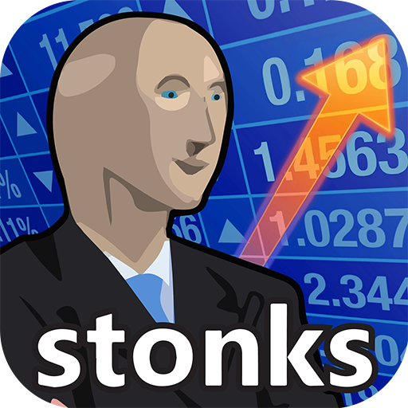
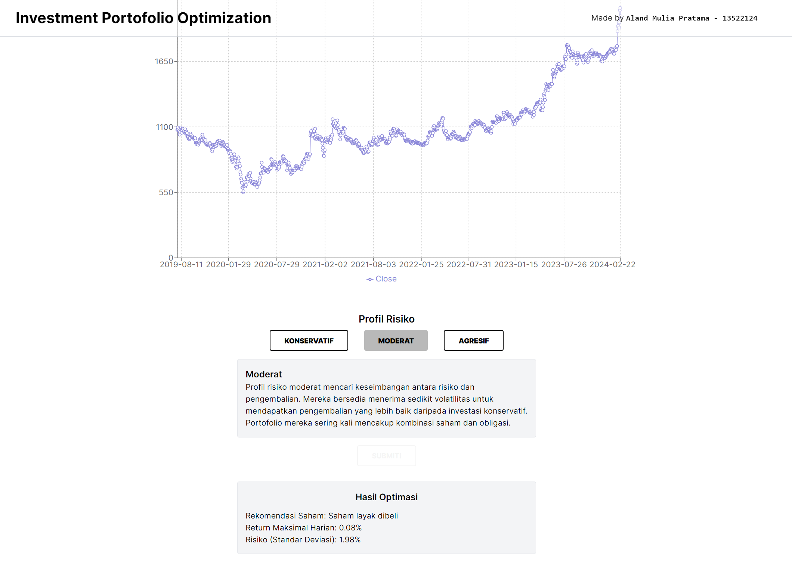

  

# 📚🪜 Stocks Portfolio Optimization

> 🌐 Web-Based Stocks Portfolio Optimization Program by using Branch and Bound Algorithms

🎓 **Project Background:**
I created the Stocks Portfolio Optimization Program as part of my Algorithm Strategies journal assignment during my fourth semester in the Computer Science program at Bandung Institute of Technology.

## 🪪 Contributors
| Nama | NIM |
|---|---|
| Aland Mulia Pratama | 13522124 |

## 📝 Description
### Modern Portfolio Theory

Modern Portfolio Theory (MPT) was introduced by Harry Markowitz in 1952. MPT states that investors can build efficient portfolios by combining various assets to reduce total risk through diversification. The main principle of MPT is the trade-off between expected return and risk, which is usually measured by the variance or standard deviation of returns.

### Capital Asset Pricing Model
Risk and return models that are often used in portfolio optimization include the Capital Asset Pricing Model (CAPM). CAPM is a model that describes the relationship between the expected return of an asset and market risk. According to CAPM, the expected return of an asset is a function of the risk-free rate plus a risk premium associated with the asset's beta.

### Branch and Bound Algorithms
The Branch & Bound (B&B) algorithm is used for optimization problems, namely minimizing or maximizing an objective function that does not violate the constraints of the problem. This method combines search using the Breadth-First Search (BFS) method and search with minimum cost (least cost search). In pure BFS, the next node to be expanded is based on their generation order (FIFO). However, in B&B, each node is given a cost value, namely the estimated value of the cheapest path to the destination status node through a particular status node. The next node to be expanded is no longer based on the order of generation, but the node that has the smallest cost (least cost search), especially in the case of minimization.

## 🪛 Configuration Guide

### Front-End Setup:
1. Clone the repository to your local files. Access the repository [here](repository-link).
2. Open the terminal and ensure that the directory is set to `MakalahStima_13522124/src/frontend`.
3. Run `npm install` to activate the React-JS framework and any dependencies needed by the website locally.
4. Execute `npm run dev`.

### Back-End Configuration:
1. Make sure to install Python Programming Language. You can access the GO Programming Language Installer [here](https://www.python.org/downloads/). Make sure to add PATH during installation on your device.
2. After the Python Programming Language is successfully installed, execute `pip install requirements.txt`.
3. After dependencies are successfully installed, change the directory to `MakalahStima_13522124/src/backend`.
4. Run the backend by executing `python app.py` on the terminal.

## 🏃‍♂️ How to Run
1. Access the Stocks Portfolio Optimization website page at http://localhost:3000.
2. Enter the stocks dataset in (.csv) extension. Inputs cannot be submitted until you have chosen the type of risk profile.
4. Once everything has been verified as correct, you can press the submit button and wait for the results of the Stocks Portfolio Optimization program.

## 📸 Screenshots

  
  
<i>Solution Generated by Program</i>

